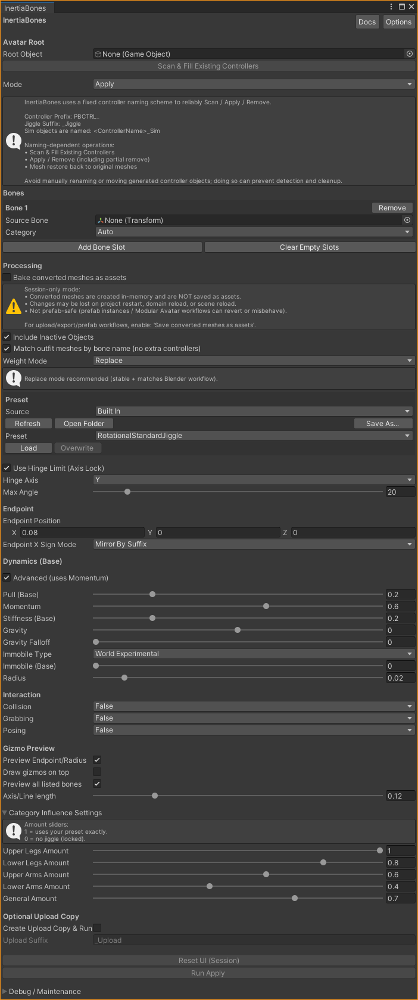
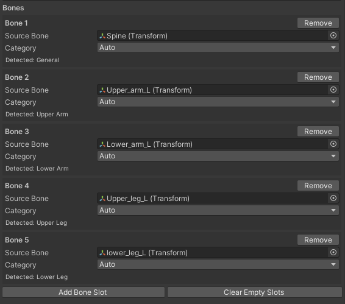

# Configuration settings

## UI Explanation

### Header buttons:

- **Docs**: takes you to the page you are currently on.
- **Options**: where global settings will be placed

### Avatar Root / Bones section

- **Avatar Root**: Where you place the avatar you want to perform operations on.
- **Bones**: An expandable list where you add the source-bones you want to perform the operations on. (example: upper-/lower- legs)
	- Category: Used for controlling influence sliders, should auto-detect most naming standard, if not then you can manually select it.
	- Add Bone Slot / Remove: adds or removes slots from the Bone list
	- Clear Empty Slots: Clears slots where Source Bone == None

^ Here you can see the typical behaviour of automatic category detection.

### Processing

- **Bake converted meshes as assets**: toggles between **Session** and **Persist (Bake)** modes.
- **Include Inactive Objects**: decides whether the tool will target inactive meshes (example: hidden outfit in the hierarchy)
- **Match outfit meshes by bone name**: Standard (recommended) to have this on, that way the tool won't create any extra controllers on additional outfit armatures (when using MA)

- **Weight Mode**: Decides how the tool will rewrite weight when applying.
	- Replace (Standard): Writes all weight from **Source** bone -> **_Jiggle** bone.
	- Split: Alternative method that will split weight based on a float between **Source** bone and **_Jiggle** bone.

### Preset

Choose between **Built In** and **Custom**. This is where you can load presets, or when using **Custom**, save / overwrite your own.

Custom presets are saved here: \Assets\Corner22\InertiaBonesData\Presets\Custom

Currently, the different Built In presets are categorized between *Rotational* and *Angle*:

- Rotational: the standard PB dynamics (rotates on a single axis)
- Angle: typical PB dynamics (Currently very limited and often requires extremely low Max Angle values)

### Hinge / Max Angle

- **Use Hinge Limit (Axis Lock)**: Must be On for **Rotational** and Off for **Angle Based** movement.
- **Hinge Axis** (Standard: Y): decides which axis the **Hinge Limit** operates on.
- **Max Angle**: Self-explanatory (PhysBone parameter)

### Endpoint

!!! tip
	Testing showed that the length of the endpoint can affect the final PhysBone jiggle (Especially very short lengths)

- **Endpoint Position**: Self-explanatory, but do note that they should be extended from X if working with **Hinge Axis**: Y, this is required for the Hinge Limit to function properly.
- **Endpoint X Sign Mode**: simple setting for choosing whether endpoints should be **Mirrored**, **Inverted** or **Manual** (previewable with Gizmo preview).

### Dynamics (Base)

!!! info
	We recommend using the **Advanced** toggle so *Spring* -> *Momentum*, this is due to how much better **Momentum** works for jiggle.

All of these settings are just like the PhysBone component settings.

We recommend using **Immobile Type: World Experimental** to minimize unintentional jiggle from locomotion. 

Any parameters with a **(Base)** suffix are used to control the influence settings.

**Gizmo Preview** allows you to preview endpoints (blue) and axis (orange)

### Category Influence Settings

These are sliders that work directly off of the detected (or manually chosen) categories in your **Bones** list, 
these will let you control the "falloff" of the PhysBone jiggle depending on what category the source bones are.
We recommend using generally high values on these sliders, as they can very aggressively make your PhysBone preset feel stiff / less jiggly.

### Optional Upload Copy

This will apply the changes to a duplicated copy of your avatar, instead of applying them directly to your current active avatar.

### Reset UI / Run

- **Reset UI (Session)**: resets the UI to its default state.
- **Run** ***Apply*** or ***Remove*** (Depending on which Mode is selected) : Runs the operations and applies the changes,

### Debug / Maintenance

Small foldout on the bottom of the UI for debugging or maintaining tool backup and similar.

- **Clean Old Baked Meshes (Keep Last 2)**: will delete all GeneratedMeshes for the currently selected avatar so long as they are not in use (i.e not referenced by **any** SkinnedMeshRenderer) and older than 2.
- **Repair Backup References (Resolve Missing SMRs)**: will utilize several methods sequentially in an attempt to restore backup entries such as SkinnedMeshRenderer-paths and bone arrays.
- **Reveal Editor Data Root**: reveals the hidden _InertiaBonesEditorData object that holds backup entries, used for debugging purposes. (SMR, Original Mesh reference, Original Bones)
- **Hide Editor Data Root**: Simply re-hides the object.

!!! info
    Detailed info regarding the **Repair Backup References** button and its reason for existing is written in the **Known Issues** section.

