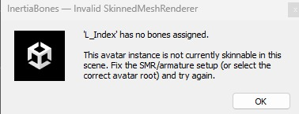

# FAQ

## Does this modify my original mesh?

No.  
Persist Mode never overwrites existing mesh assets.

---

## Meshes on my avatar appear warped and/or distorted after applying the tool.

This is likely due to a compatibility issue with an interfering tool/prefab on the avatar. Tools or similar that apply changes to meshes or in some cases the armature, on run-time or when uploading can and will in many cases mess with the tool.

I currently have little conclusive evidence to point at this being a bug rooted inside of InertiaBones, and more-so due to an unpreferable sequence of changes made to the avatar with the help of tools / optimizers / certain gimmicks.

!!! info
	If you are experiencing similar issues, please head to the **Compatibility** tab, and follow the instructions there.
[Compatibility →](compatibility.md){ .md-button .md-button--primary }

## Meshes on my avatar disappear after using the tool.

This usually means you have applied the tool using the **Session-Only mode** and then performed an action that calls a Scene-Refresh/-Reload/-Reset, which in turn *can* lose the converted meshes saved *in-memory*.

This has been seen to happen due to following actions:

	- Uploading the avatar
	- Swapping scene
	- Re-opening project
	- Making the avatar into a prefab and moving it across scenes

In the upcoming V1.1.0 version of InertiaBones, this behaviour has been altered slightly to be more resilient, alongside the fact that Unity will in some cases serialize the in-memory cloned meshes with the scene/prefab state, which allows them to persist in certain scenarios, but you should still bake your converted meshes.

!!! Info
	This can be fixed by using the tool to **Remove** and **Apply** the setup again to the avatar in question, make sure to use **Bake converted meshes as assets** if you want to prevent this from happening in the future.

---

## Can I use this if I already have thigh / belly / butt PhysBones?

Yes.

InertiaBones adds controller chains only to the bones you explicitly select and does not remove or overwrite existing PhysBone setups. Existing PhysBone components, constraints, and child chains remain intact.

The tool has been tested on complex multi-bone/multi-child thigh, belly, and butt rigs and integrates cleanly, often enhancing overall motion when tuned properly.

Only the bones you choose to convert are affected.

!!! note
	This behavior assumes your existing PhysBone setups are located directly under the avatar’s root armature at the time of applying. Unusual hierarchy structures may require manual review. 

## How can I remove everything from my avatar?

Simply change the mode to **Remove** and use **Scan & Fill Existing Controllers**, then run **Remove**.
This will remove all objects created by the tool, write weights back to the source bones and change mesh references back to their original.

---

## "**'*MeshName*' has no bones assigned.**" when attempting to run **Apply**

This is due to static meshes in the avatar hierarchy that don't have an armature/bones, which causes the tool to mistake them for an inelligible avatar or outfit rig. To fix this, simply move the static meshes out of the avatar hierarchy or remove them completely before re-running the **Apply**

A solution to this issue will come in the V1.1.0 update, where you will now be shown a dialog box listing any ineligible meshes for inspection, along with options to either **Skip and Continue** or **Cancel**.

---

## Why does "MA Scale Adjuster" revert scaling after applying?

This is due to *MA Scale Adjuster* scaling based on weighted vertices attached to the bone the component is attached to, since InertiaBones rewrites weights, this will undo that scaling. You can work around this by moving the *MA Scale Adjuster* component to the **_Jiggle** bones.

!!! Warning
	Be aware that this goes against the recommended workflow and can in turn partially break the backup stored in the hidden **_InertiaBonesEditorData** object, so we recommend either having a backup copy of your avatar or using the **Create Upload Copy** option.

---

## Can I run Persist (Bake) multiple times?

Yes.  
Each run creates a new baked asset.

Retention settings control cleanup.

---

## What happens if I unselect existing controllers (removing them from the Bones list) after baking and try to bake again?

If you previously baked with certain controllers enabled, and then deselect one or more of them before baking again, a warning will appear.

This happens because those controllers may still influence vertex weights in the mesh. Deselecting them without proper handling could unintentionally remove their influence.

You will be given three options:

- Cancel – Stop and review your selection.
- Scan & Fill – Resync the UI with the existing controllers. (Optionally add more if that was your intention)
- Run Anyway – Continue intentionally and remove their influence during the new bake.

This safeguard prevents accidental weight changes when modifying an already baked setup.

---

## Can this corrupt my avatar?

Under normal usage, no.

The tool enforces strict invariants:
- No asset overwrite
- No bindpose shrink
- No bone index drift

---

## Where are baked meshes stored?

Inside:

Assets/Corner22/InertiaBonesData/GeneratedMeshes/Avatar-name/

User data is separated from tool source and is stored in its own folder (InertiaBonesData).
This folder should not be deleted if you are updating the tool to a newer version (Ensures you keep your presets and generated meshes).